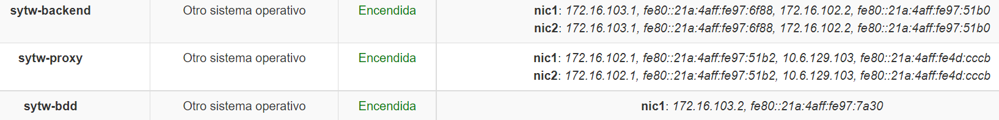
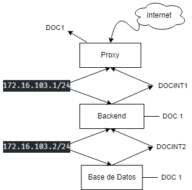
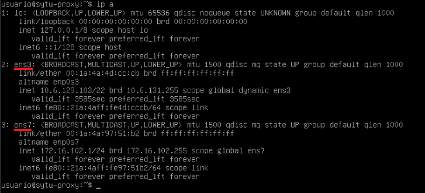
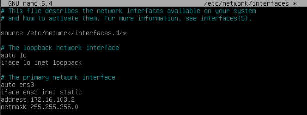
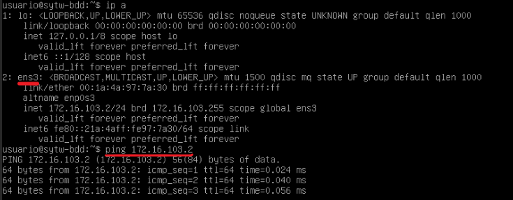

# Práctica 1 - Jerarquía de servidores

## Índice
- [1. Introducción.](#introduccion)
- [2. Creando las máquinas virtuales.](#maquinas)
- [3. Configuración interfaces.](#configuracion)
- [4. Pasos a seguir con las maquinas virtuales.](#pasos)
- [5. Esquema.](#esquema)
- [6. Proxy.](#proxy)
- [7. Backend. ](#backend)
- [8. Base de Datos (BD).](#bd)
- [9. Referencias.](#referencias)

## 1. Introducción. <a name="introduccion"></a>

El objetivo de la práctica es dejar preparado una serie de conexiones entre **3 servidores** para simular la interconexión de un proxy con un servidor que hará de backend, y este a su vez estará conectado a otra máquina que hará de la supuesta base de datos.

Para ello se nos ha ofrecido un rango de IP que será el que usaremos para establecer las distintas subredes que harán posible dicha conexión. En este caso trabajaremos con las IP comprendidas entre **172.16.102.X** y **172.16.103.X** con máscara 255.255.255.0 (/24)

## 2. Creando las máquinas virtuales. <a name="maquinas"></a>

- Nos dirigimos la pagina del IAAS, y crearemos las 3 máquinas, pues se nos ofrece una plantilla *Debian11*


## 3. Configuración interfaces. <a name="configuracion"></a>

- Antes de todo, configuramos para cada máquina los nombres de las interfaces, para ello hacemos el comando:

```console
$ sudo hostnamectl set-hostname <nuevo nombre>
```


- Una vez modificado los hostname reiniciamos la máquina para ser efectivo el cambio.

## 4. Pasos a seguir con las maquinas virtuales. <a name="pasos"></a>

1. Para la **Proxy** ➔ seleccionamos *nic1(DOC1/DOC1)* y un *nic2(DOCINT1/DOCINT1)*
2. Para el **Backend** ➔ seleccionamos un *nic1(DOCINT1/DOCINT1)* y *nic2(DOCINT2/DOCINT2)*
3. Para la **Base de datos** únicamente agregamos una interfaz *nic1(DOCINT2/DOCINT2)*, pues sólo estara conectado al Backend.

- Para el Proxy:
  - ens3 ➔ 10.6.129.103 - (```ssh usuario@10.6.129.103```)
  - ens7 ➔> 172.16.102.1 
- Para la Backend: **(En Proxy)**
  - ens3 ➔ 172.16.102.2 - (```ssh usuario@172.16.102.2```)
  - ens5 ➔ 172.16.103.1
- Para la Base de Datos: **(En Backend)**
  - ens3 ➔ 172.16.103.2 - (```ssh usuario@172.16.103.2```)

Aquí se puede observar las maquínas encendidas con todas su Direcciones IP.



Ahora entramos en cada una de las máquinas y configuraremos las interfaces. Para ello escribimos el comando para saber el estado de las mismas:

```console
$ ip a
```

## 5. Esquema. <a name="esquema"></a>



## 6. Proxy. <a name="proxy"></a>

En la parte Proxy tenemos como interfaz `ens3 y ens7`.


En la que configuraremos las interfaces para *ens3* como publica y *ens7* como privada apuntando al Backend agregando la IP y la máscara correspondiente. 

El comando en cuestión sera:

```console
$ sudo nano /etc/network/interfaces
```


Por último se puede mostrar en las dos interfaces están levantadas haciendo un uso del comando `ip a`.




## 7. Backend. <a name="proxy"></a>

Para el Backend lo mismo, configuramos las interfaces correspondientes, en este caso `ens3 y ens5`, las dos como privadas y apuntamos sus correspondientes IP y máscara. 


Y se muestra correctamente las dos interfaces levantadas, y hacemos un uso del Ping hacia el Proxy, en este caso la *172.16.102.1*


## 8. Base de Datos (BD). <a name="bd"></a>

Por último para el la base de datos, configuraremos la interfaz correspondiente, la `ens3` como privada con su IP y máscara correspondientes.



Y se muestra correctamente la interfaz levantada, y hacemos un uso del Ping hacia el Backend, en este caso la *172.16.103.2*



## 9. Referencias. <a name="referencias"></a>

- [Guión Práctica 1](https://campusingenieriaytecnologia2223.ull.es/mod/assign/view.php?id=10664)
- [Configuración Debian](https://wiki.debian.org/es/NetworkConfiguration)