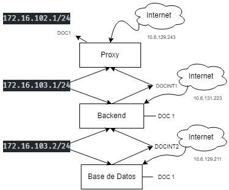
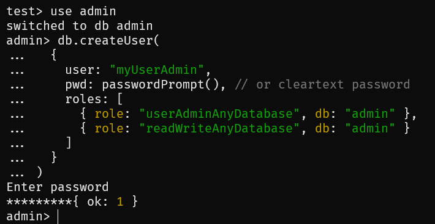

# Práctica 2 - Despliegue de una aplicación MEAN en el IaaS de la ULL

## Índice
- [1. Introducción.](#introduccion)
- [2. Nueva Configuración. Maquinas Virtuales.](#maquinas)
- [3. Configuración NGINX. [Proxy].](#nginx)
- [4. Configuración NodeJS. [Backend].](#NodeJS)
- [5. Configuración MongoDB. [Base de Datos].](#MongoDB)
- [6. Montaje NFS. [Base de Datos-Backend].](#nfs)
  - [6.1. Sesión Base de Datos. (Servidor de Exportación).](#sesionBD)
      - [Explicación Permisos de Carpetas.](#permisoscarpetas)
  - [6.2. Sesión Backend. (Cliente Importación).](#sesionbackend)
    - [Explicación Permisos de Montajes.](#permisosmontajes)
- [7. Referencias.](#referencias)

## 1. Introducción. <a name="introduccion"></a>

El objetivo de esta práctica es instalar los componentes necesarios y ejecutarlos para poder ejecutar una aplicación **MEAN** en nuestro backend de forma que esté protegida por nuestro proxy con la redirección adecuada.

## 2. Nueva Configuración. Maquinas Virtuales. <a name="maquinas"></a>

A la vista de los problemas causados por la arquitectura 32x del debian 11, se ha propuesto cambiar todas las maquinas por **debian 10**.

Y en las **3 máquinas** debemos ejecutar este comando:
```console
sudo apt-get update --allow-releaseinfo-change
```
### Quedaría tal que así:

> Configurar NICS para Proxy, Backend y BD.

> Configurado `/etc/hostname/`, `/etc/hosts/` y `/etc/network/interfaces/` con sus respectivos casos.

> 2 nics NUEVOS (DOC1/DOC1) para Backend y Base de datos con protocolo DHCP.

- **Proxy**: *(ssh usuario@10.6.129.243)*
  - ens3 -> 10.6.129.243 (DHCP)
  - ens4 -> 172.16.102.1
- **Backend**: (Dentro de Proxy) - *(ssh usuario@172.16.102.2)*
  - ens3 -> 172.16.102.2 
  - ens4 -> 172.16.103.1
  - ens9 -> 10.6.131.223 (DHCP)
- **Base de Datos**: (Dentro de Backend) - *(ssh usuario@172.16.103.2)*
  - ens3 -> 172.16.103.2 
  - ens4 -> 10.6.129.211 (DHCP)



## 3. Configuración NGINX. [Proxy]<a name="nginx"></a>

El servicio **NGINX** será nuestro proxy que filtrará las IP y reenviará las peticiones al backend para que podamos visualizar la aplicación express desde la interfaz DHCP del proxy (en nuestro caso la 10.6.129.103) 

`ssh usuario@10.6.129.103`

Primeramente se instalará NGINX (actualizamos previamente para evitar errores)

```console
$ sudo apt update
$ sudo apt install nginx
```
Y ahora comprobamos que el servicio funciona correctamente.

```console
$ curl -I 127.0.0.1
```

Una vez realizado, es importante saber como se maneja estos servicios. Como por ejemplo, para pararlo, levantarlo o reiniciarlo, o incluso evitar que se inicie en el arranque o volver a habilitarlo.

```console
$ sudo systemctl stop nginx
$ sudo systemctl start nginx
$ sudo systemctl restart nginx
$ sudo systemctl reload nginx
$ sudo systemctl disable nginx
$ sudo systemctl enable nginx
```
Ahora debemos configurar el NGINX, para que así, podamos tratar las IPs que le llegan por el puerto 80 y enviar la solicitud al puerto de escucha del **Backend** (que según nuestro esquema de la práctica anterior es 172.16.102.2). 

Es por ello, que creamos un fichero llamado `reverse-proxy.conf` ubicado en `/etc/nginx/sites-available` que contenga:


Con esta configuración lo que hacemos es que escuche cualquier IP en el puerto 80 y que lo redirija con **proxy_pass** a nuestra interfaz del Backend que lo comparte con el Proxy

Ahora tenemos que desvincular el fichero nginx que trae por defecto, para ello nos situamos en `sites-enabled` y ejecutamos:

```console
$ sudo unlink default
```
Una vez realizado ese paso, se debería desvincular a nuestro el nuevo fichero:

```console
$ sudo ln -s /etc/nginx/sites-available/reverse-proxy.conf /etc/nginx/sites-enabled
```
Y nos quedaría tal que así, haciendo un LS. Y con esto pasamos a configurar el Backend.

```console
ls -la /etc/nginx/sites-enabled/
```


Y compramos el funcionamiento a través del navegador con nuestra dirección.


## 4. Configuración NodeJS. [Backend].<a name="NodeJS"></a>

En esta parte del Backend, vamos a tratar de incluir en nuestro modelo a tres capas, instalando el NodeJS mediante la siguiente instrucción y, en este caso usando cURL para extraer el script bash. 

```console
$ sudo apt update
$ sudo apt install curl
$ curl -sL https://deb.nodesource.com/setup_10.x | sudo -E bash -
$ sudo apt install nodejs
```

Una vez realizado estos pasos, instalamos el gestor de paquetes de node *npm*, así podemos instalar los *node_modules*.

```console
$ sudo apt install build-essential libssl-dev
```
Aparte de esto, también instalaremos un framework muy popular de Node, en la que proporciona mecanismos para utilidades HTTP, el "Express"

```console
$ sudo npm install express
```

A la vista que tenemos todo instalado, vamos a probar ejecutar una, para ello el profe nos ha dado un [ejemplo de un repositorio github](https://github.com/crguezl/express-start). Para ello clonamos el repositorio, pero antes debemos configurar las keys pairs con nuestra cuenta de github y configurarlo todo correctamente.

```console
$ sudo apt install git
$ git clone git@github.com:crguezl/express-start.git
```

Una vez que tengamos la aplicación subida, nos dirigimos a nuestra ubicacion `.../express-start/` e instalamos unos paquetes requiridos.

```console
$ sudo npm i
```
Para hacer el trabajo mas ameno en vez de utilizar la consola, nos conectaremos con VSCode en el Backend.
```console
$ ssh usuario@10.6.131.223
```
Para finalizar, cambiamos una serie de datos para que la aplicación pueda escuchar la IP que nos interesa, es decir, la **172.16.102.2 con puerto 3000**


Con ello arrancamos la aplicación y la visualizamos correctamente:


## 5. Configuración MongoDB. [Base de Datos].<a name="MongoDB"></a>

Como bien habiamos dicho en el apartado 4. Tenemos un nic en la que nos da acceso al Internet, puesto a ello, instalaremos una serie de paquetes:

```console
$ wget -qO - https://www.mongodb.org/static/pgp/server-6.0.asc | sudo apt-key add -
$ sudo apt-get install gnupg
$ echo "deb http://repo.mongodb.org/apt/debian buster/mongodb-org/6.0 main" | sudo tee /etc/apt/sources.list.d/mongodb-org-6.0.list
$ sudo apt-get update
$ sudo apt install mongodb-org -y
```

Tenemos en `/etc/systemd/system/mongodb.service` 


Y lo activamos:
```console
$ sudo systemctl enable mongodb
```
Además tenemos por defecto en `/etc/mongod.conf`


Comprobamos que el servicio funciona correctamente con el comando:

```console
sudo systemctl status mongod.service
```


```console
$ sudo systemctl start mongodb
$ mongosh
```

Ahora accedemos el MongoDB sin control de acceso, para ello escribimos: 

```console
$ mongod --port 27017 --dbpath /var/lib/mongodb
```

A continuación, accedemos al mongosh como `$mongosh --port 27017` y escribimos:

```py
use admin
db.createUser(
  {
    user: "myUserAdmin",
    pwd: passwordPrompt(),
    roles: [
      { role: "userAdminAnyDatabase", db: "admin" },
      { role: "readWriteAnyDatabase", db: "admin" }
    ]
  }
)
```


Y volvemos a apagar la instancia del mongodb
```console
$ db.adminCommand( { shutdown: 1 } )
```


Ahora nos conectamos y autenticamos como administrador de usuarios, 
```console
mongosh --port 27017  --authenticationDatabase \ "admin" -u "myUserAdmin" -p
```


Ahora si queremos tener la autenticación activada, una de las formas es mendiante por consola con "--auth", es decir:

```console
mongod --auth --port 27017 --dbpath /var/lib/mongodb
```

O si queremos iniciar el mongodb con la autenticacion, añadimos en `security.authorization`, dentro de /etc/mongo.conf


Una vez finalizado. Probamos y creamos nuestra base de datos con usuario con permisos de lectura y escritura con nuestro usuario "ADMIN".

```console
> use admin
> db.createUser({user: "dbadmin", pwd: "secretpass", roles:[{role: "root", db: "admin"}]})
```

Reseteamos el mongodb y lo iniciamos, y despues llamamos al shell de mongodb como admin

```console
$ mongosh -u "dbadmin" -p "secretpass" --authenticationDatabase "admin"
```


Y ahora craeamos una base de datos llamado **"db01"** que será con la que va a comunicar del backend con la shell como dbadmin en admin
```console
> use db01
> db.createUser({user: "javi", pwd: "pass", roles: ["readWrite"]})
```


Se habrá de recordar estos datos pues serán los que se van a usar en nuestra aplicación MEAN

## 6. Montaje NFS. [Base de Datos-Backend]<a name="nfs"></a>

Ahora, en esta parte vamos a tener una parte dividida. Pues en la BD tendremos que exportar una carpeta compartida y el backend actuará de cliente para importar el contenido de la carpeta exportada.

### 6.1. Sesión Base de Datos. (Servidor de Exportación).<a name="sesionBD"></a>

Instalamos el NFS dedicado a exportar:

```console
$ sudo apt-get install -y nfs-kernel-server
```
Como nos pide que sea versión 4, cambiamos los ficheros `/etc/default/nfs-common` y `/etc/default/nfs-kernel-server`


A continuación, creamos la carpeta para compartir:
```console
$ cd $HOME
$ mkdir share
$ sudo chown root share 
$ sudo chmod 777 share
```

Para ello, editamos el `/etc/exports` a nuestra carpeta compartida, y con la dirección de la Base de Datos finalizando con ".0".


### Explicación Permisos de Carpetas.<a name="permisoscarpetas"></a>

- *`rw`* -> El directorio será compartido en lectura y escritura (rw).
- *`sync`* -> Comunica al usuario los cambios realizados sobre los archivos cuando realmente se han ejecutado y es la opción recomendada.
- *`*no_root_squash`* -> desactiva la opción anterior, es decir, los accesos realizados como root desde el cliente serán también de root en el servidor NFS.
- *`no_subtree_check`* -> permite que no se compruebe el camino hasta el directorio que se exporta, en el caso de que el usuario no tenga permisos sobre el directorio exportado.

Ahora exportamos directorios especificados en el fichero sin necesidad de reiniciar los servicios NFS.

- -r -> Provoca que todos los directorios listados en /etc/exports sean exportados construyendo una nueva lista de exportación en /etc/lib/nfs/xtab. Esta opción refresca la lista de exportación con cualquier cambio que hubiéramos realizado en /etc/exports.

- -a -> Exporta todos los sistemas de archivos especificados en /etc/exports.

```console
$ sudo exportfs -ra
```
### 6.2. Sesión Backend. (Cliente Importación).<a name="sesionbackend"></a>

Instalamos NFS dedicado a importar

```console
$ sudo apt-get -y install nfs-common
```

A continuación editamos el fichero `/etc/fstab` para configurar los montajes del arranque.


### Explicación Permisos de Montaje.<a name="permisosmontajes"></a>

- *`type`* = nfs
- *`options`*
  - *rw* -> Lectura/escritura
  - *sync* -> Entrada/salida de manera síncrona
  - *hard* -> Especifica que si el programa que usa un archivo vía una conexión NFS, debe parar y esperar.
- *`intr`*, permite que se interrumpan las peticiones NFS si el servidor se cae o no puede ser accedido.
- *`dump`* = 0 -> No se toma en cuenta el dispositivo para hacer respaldo del sistema de archivos por el comando dump
- *`pass`* = 0 -> La aplicación fsck no revisará la partición en busca de errores durante el inicio.

Para terminar lo montamos y listo.

```console
$ sudo mount
```
## 8. Referencias. <a name="referencias"></a>

- [Guión Práctica 2](https://campusingenieriaytecnologia2223.ull.es/mod/assign/view.php?id=10665)
- [Pasos Instalar MongoDB](https://www.mongodb.com/docs/manual/tutorial/install-mongodb-on-debian/)
- [Autenticación MongoDB](https://www.mongodb.com/docs/manual/tutorial/configure-scram-client-authentication/)
- [Instalar servidor NFS](https://wiki.debian.org/NFSServerSetup)
