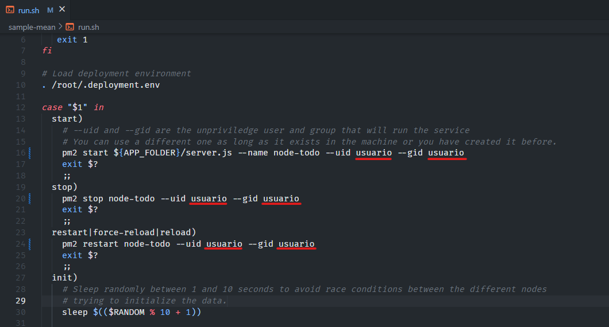
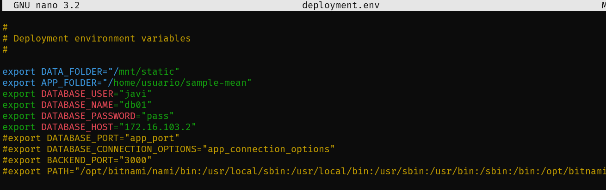
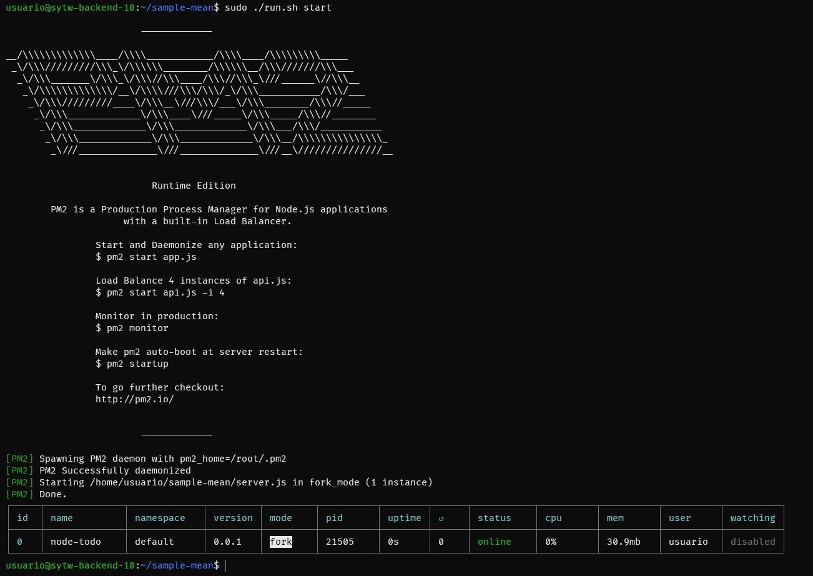
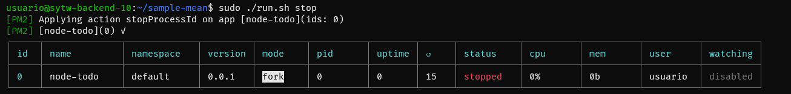
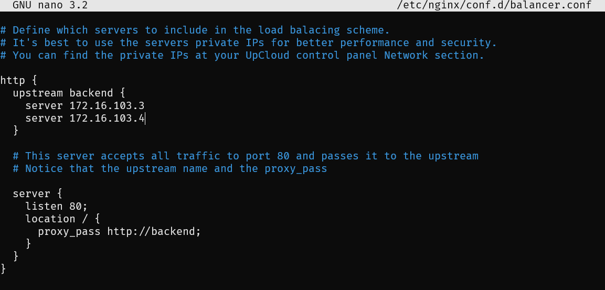

# Práctica 3 - Despliegue de una aplicación MEAN en el IaaS de la ULL (2)

## Índice
- [1. Introducción.](#introduccion)
- [2. Desplegar en el Backend una aplicación MEAN de Prueba. (Backend)](#desplegar)
- [3. Clonando de la MV Backend.](#clonado)
- [4. Configurar el Proxy como Sistema de Balanceo de Carga](#balanceo)
- [5. Referencias.](#referencias)

## 1. Introducción. <a name="introduccion"></a>

El objetivo de esta práctica 3 es completar el despliegue de la **aplicación MEAN** y luego clonarlo en la máquina correspondiente al Backend para crear una estrategia horizontal que haga de balanceo de carga. Con ello, necesitaremos configurar el nginx para que nos dote de ese servicio.


## 2. Desplegar en el Backend una aplicación MEAN de Prueba. (Backend)<a name="desplegar"></a>

Lo primero de todo será descargar nuestra aplicación **bitnami** y cargarla con el método que se prefiera (*git clone*). 

Tendremos que tocar el script de ejecución `run.sh` para que el uid definido allí sea el mismo que el de nuestra máquina, lo que se traduce en sustituir todas las veces que se repita la palabra "bitnami" por "usuario".



A continuación en el fichero `.deployment.env` que es el fichero de configuración de variables de entorno. Ubicado en la carpeta /root/. 

Para ello hacemos:

```console
$ sudo su
$ touch /root/.deployment.env
```
Y añadimos la información basándonos en la guía del funcionamiento interno de la propia aplicación explicado en su [repositorio](https://github.com/bitnami/sample-mean).

Como se puede observar, en:
- **DATA_FOLDER**: Se pondrá la ruta de nuestro montaje desde la base de datos
- **APP_FOLDER**: La ruta de nuestra aplicación MEAN
- **Resto de constantes**: Explicaciones explícitas de la base de datos.




Una vez conseguido esto, iniciamos los servicios necesarios dentro de la ruta `/sample-mean/`

```console
$ sudo ./run.sh start
```




## 3. Clonando de la MV Backend. <a name="clonado"></a>

Para empezar, se debe parar la aplicación para no tener ningún tipo de problema.

```console
$ sudo ./run.sh stop
```


Con todo ello, en nuestro panel de administración (IaaS), hacemos shutdown en la máquina objetivo y con click derecho seleccionamos **Clone MV.**

Realizamos las configuraciones como en la práctica 1, modificando las interfaces, así como:

- 172.16.103.1 Para las conexiones entre Backend y Proxy. 
- 172.16.103.2 Para las conexiones entre Backend y BD.

Podemos asignarle **172.16.103.3** y **172.16.103.4** a los nics (DOCINT)

Levantaremos de nuevo las máquinas y nos moveremos al proxy para configurar el servicio de balance de carga con nginx.


## 4. Configurar el Proxy como Sistema de Balanceo de Carga. <a name="balanceo"></a>
Creamos un fichero para disponer de dicho balanceador. Entonces, editamos el fichero con permiso de superusuario.
```console
$ sudo nano /etc/nginx/conf.d/balancer.conf
```


Una vez realizado, reiniciamos el servicio y comprobamos que todo esté correcto mirando los logs del balanceador. `/var/log/nginx/access.log` y si se levantó con:
```console
$ pm2 *root/.pm2/logs*
```
Luego podemos verificar, cómo nuestro acceso a la página es distribuido en las distintas máquinas backend monitorizando las nuevas sesiones.


## 5. Referencias. <a name="referencias"></a>

- [Guión Práctica 3](https://campusingenieriaytecnologia2223.ull.es/mod/assign/view.php?id=10665)
- [Bitnami](https://github.com/bitnami/sample-mean)
- [Node-Todo](https://github.com/scotch-io/node-todo)